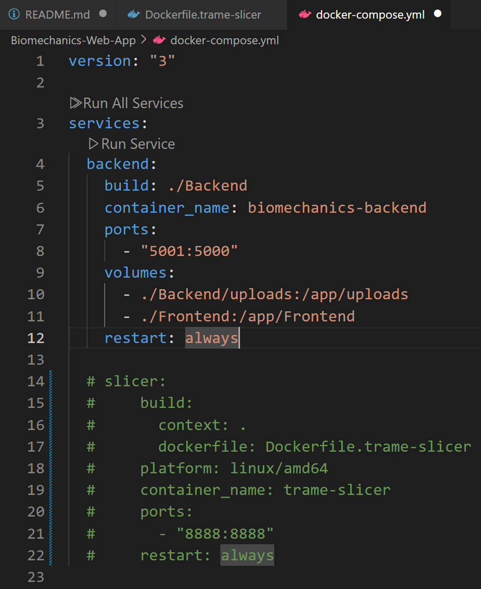

# Biomechanics-Web-App

1. **Clone the code on your local environment**

```bash
git clone git@github.com:Rachoool/Biomechanics-Web-App.git

```

> **Note:**  
> - Please check if there are any Docker configuration files after cloning.  
> - During cloning, there is a probability that some models may not be fully downloaded.  
> - If this happens, please open the repository page and **download as ZIP** to get the complete files.  
> - Repository: [Rachoool/Biomechanics-Web-App](https://github.com/Rachoool/Biomechanics-Web-App)

---

### 1.2 Build and run

Go to the project directory, then run:

```bash
docker compose build
```

> Make sure the `.sh` file in the `workers` folder has **LF** line endings, not **CRLF**.

After building the project, run:

```bash
docker compose up
```

If no error appears, the application is running successfully.

Access it via:

```
http://localhost:5001
```
or
```
http://127.0.0.1:5001
```

---

---

## 2. Compatibility Notes

Due to the sensitivity of the **Trame slicer** tool to environmental configurations,  
compatibility issues may occur with different models or software versions.

If the slicer license prevents deployment,  
comment out the slicer section in the `docker-compose.yml` file and try running again.


---